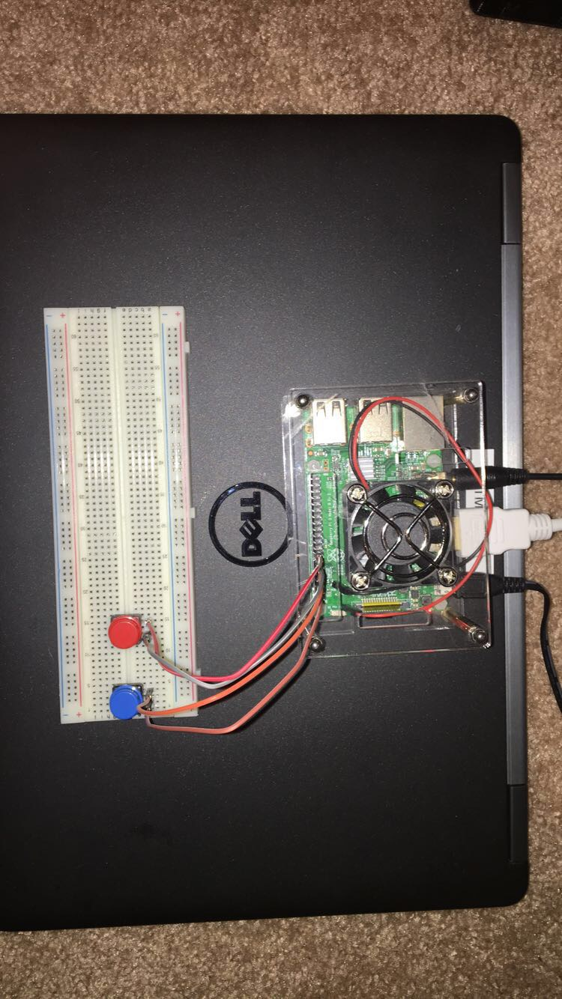

# Achoo
Achoo uses a Raspberry Pi to predict if my son will need his inhaler on any given day using weather, pollen, and air quality data. If the prediction for a given day is above a specified threshold, the Pi will email his school nurse, and myself, notifying her that he may need preemptive treatment. **TUTORIAL COMING SOON**

Prompted by [this](https://www.reddit.com/r/Python/comments/70udwq/what_routine_tasks_do_you_automate_with_programs/) reddit post. Lots of great ideas in there.

**UPDATE**

I will be updating this readme fairly often for the next week or two to make sure the code and instructions are as readable as possible.

First, you'll want to declare a few environment variables:

`FROM_EMAIL` - the sender's email address.<br/>
`TO_EMAIL` - the email addresses to send the alerts to.<br/>
`GMAIL_PASSWORD` - to send emails (if you don't already have one) you'll need to register an app with gmail.<br/>
`USERNAME` - the PostgreSQL username (or other database).<br/>
`PASSWORD` - PostgreSQL password.<br/>
`DARK_SKY_API_KEY` - for the weather data, I'm using [Dark Sky](https://darksky.net/dev). You get 1,000 free hits a day. Their pricing is really affordabe.<br/>
`DARK_SKY_LOCATION` - The latitude, longitude for the location you'll be tracking. <br/>
`POLLEN_ZIPCODE` - The zipcode you'll be tracking.<br/>

For now, the work flow is reflected in the bash script that runs daily:

```
#!/bin/bash
Rscript train_model.r &&

python get_allergy_data.py && python get_weather_data.py && python get_air_data.py &&

Rscript run_model.r &&

python get_resutls_send_email.py
```

1) Train the model (this assumes we have data, so I'll upload some test data that I've been using)
2) Get all weather, allergy, and air quality data
3) Run the model (this will write the results to the database after every run)
4) Retrieve the results (this is the step that sends the email if the prediction is greater than X).

This bash script currently runs as a cron job.

To record the inhaler/breathing treatment data, you'll run `treatment_tracker.py` from your Raspberry Pi like this:

```
$ python treatment_tracker.py &
```

I have two buttons on my Pi: one for his breathing treatment, the other for his inhaler (pics and a blog post coming soon).


**Outstanding questions**

1) Is there a better way than using a cron job?<br/>
2) The Raspberry Pi isn't ideal. Maybe we should be using [Nomie 2](https://itunes.apple.com/us/app/nomie-2/id1190618299?mt=8) to record events? (HT to [sujins](https://www.reddit.com/user/sujins) for this suggestion). I'd like to make it easy for the user to add their own method and their own host for storing data.<br/>
3) I have a feeling many users will want to easily add their own models (Nueral Networks, GBMs, GLMs, etc.). What is the best way for users to add their own models?<br/>
4) Should we support two languages? Currently I'm using Python and R.<br/>
5) I still have a lot of architectural concerns about this project so far, but I'm hoping things will be more smooth as a couple weeks' worth of development pass.<br/>
6) **LONG TERM**: How to make this non-developer friendly? How can the typical person with allergies/asthma make use of this day-to-day? Can we make this a mobile app? I think this is my end goal.<br/>

**Here's my Pi setup**




